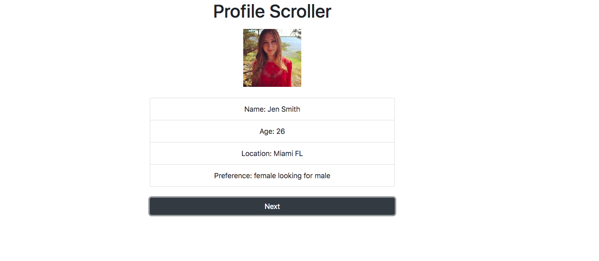
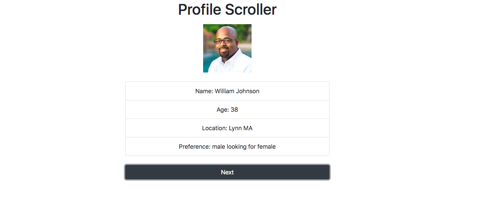

# Profile-Scroller-Iterator

## Description

This applications allows users  to scroll through profiles using a javascript Iterator. Each time the user clicks on the next button, it will scroll through different profiles.

 ## Click [here](https://brianlevin.github.io/Profile-Scroller-Iterator/) for the live app. 
 
 This is the first profile:
 
 
  
  This is the second profile:
  
  
  
  This is the third profile:
    
   
## Libraries and Frameworks:

- HTML
- CSS
- Javascript

## Email:

bml201095@gmail.com

